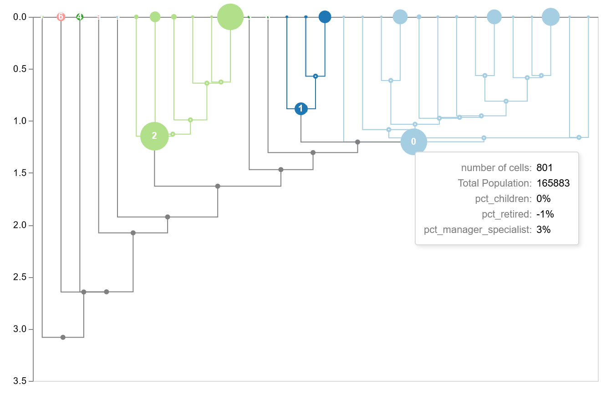

# idendrogram

idendrogram helps you create nicer, interactive visualizations of hierarchical clustering trees (a.k.a. dendrograms) from clustering outputs generated by your preferred hierarchical clustering library (SciPy, Scikit-learn or HDBSCAN) in your preferred python visualization library (Altair, Plotly or Matplotlib)

It also supports bi-directional Streamlit integration via a custom D3-powered component.




## Installation

To use the main package:

```pip install idendrogram```

To use the bi-directional Streamlit component:

```pip install idendrogram idendrogram-streamlit-component``` 

## Basic usage 

```python
import idendrogram
import scipy.cluster.hierarchy as sch
from idendrogram.targets.altair import to_altair

#cluster the data
linkage_matrix = sch.linkage(
    data['data'], method='single', metric='euclidean'
)
threshold = 0.8
flat_clusters = sch.fcluster(
    linkage_matrix, t=threshold, criterion='distance'
)

#wrap clustering outputs / parameters into a container
cl_data = idendrogram.ClusteringData(
    linkage_matrix = linkage_matrix, 
    cluster_assignments = flat_clusters
)

#pass to idendrogram and visualize
idd = idendrogram.idendrogram()
idd.set_cluster_info(cl_data)
dendrogram = idd.create_dendrogram(truncate_mode='level', p=10)
to_altair(dendrogram=dendrogram, height=200, width=629)
```

For more, see docs at https://kamicollo.github.io/idendrogram/
